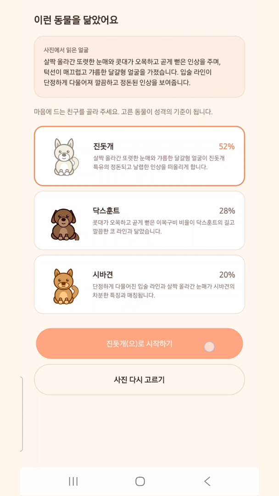
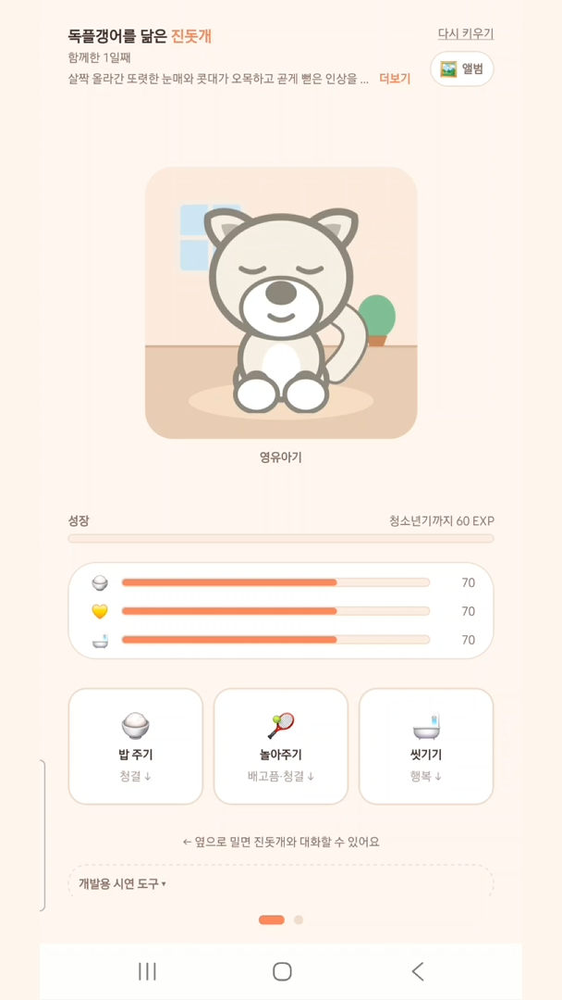
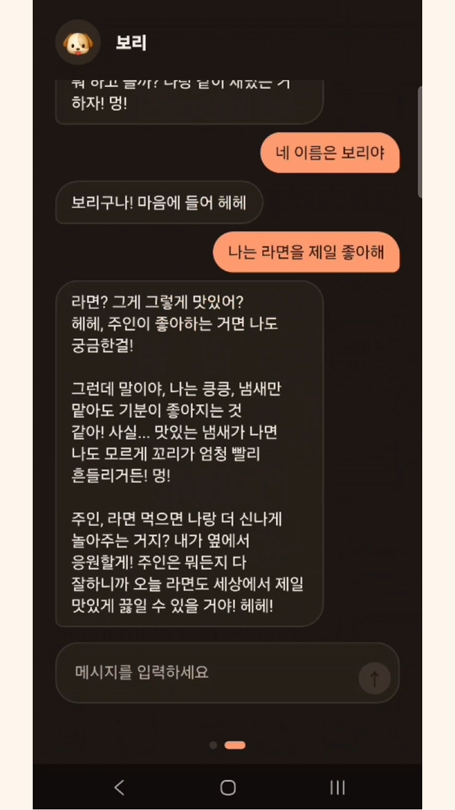
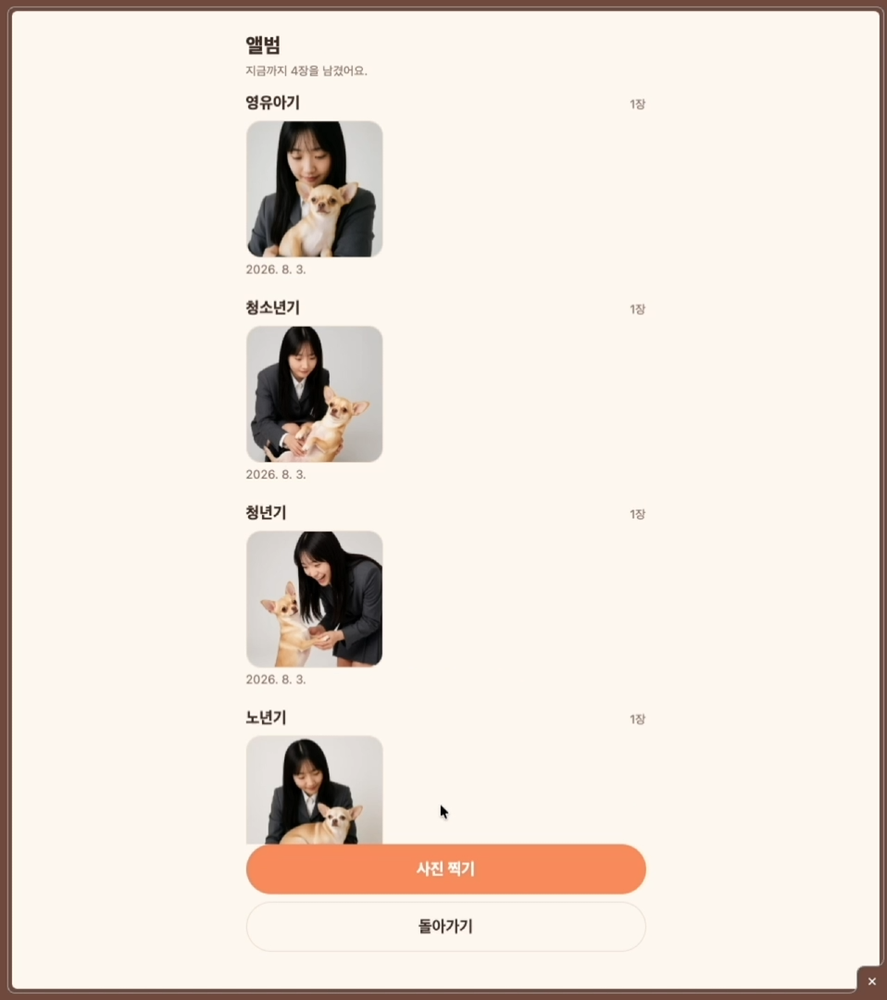

<div align="center">


# 독플갱어 🐾

**사진 한 장으로 나와 닮은 강아지를 찾아, 캐릭터로 키우고, 대화하고, 함께한 기념 사진까지 만드는 앱**

Expo SDK 57 · React Native · TypeScript · expo-router · ComfyUI · Gemini
웹과 안드로이드에서 같은 코드로 돕니다

</div>

---

## 이런 앱입니다

```
사진 올리기 → 닮은 품종 판정 → 캐릭터로 부화 → 돌보며 4단계 성장 → 대화
                                                  └→ 기념 사진 생성 → 앨범
```

얼굴 사진을 올리면 비전 모델이 **닮은 견종 조합**을 뽑습니다. 그 조합으로 캐릭터가
태어나고, 같은 조합에서 **성격**이 만들어져 대화할 때 그 성격으로 답합니다.
캐릭터를 돌보면 영유아기에서 노년기까지 자라고, 중간중간 **나와 캐릭터가 함께 있는
기념 사진**을 만들어 앨범에 모읍니다.

판정 → 캐릭터 → 성격 → 사진이 **전부 같은 견종 조합 하나에서 갈라져 나옵니다.**
네 사람이 각자 만든 기능이 한 흐름으로 이어지는 지점입니다.

## 화면

> 📷 스크린샷 준비 중입니다. `docs/screenshots/` 에 파일을 넣고 아래 주석만 벗기면
> 표로 표시됩니다 ([넣는 법](docs/screenshots/README.md)).

<!-- 스크린샷을 넣은 뒤 이 줄과 표 아래의 닫는 주석을 지우세요.
|                                                |                                        |                                      |
| ---------------------------------------------- | -------------------------------------- | ------------------------------------ |
|       |  |    |
| 닮은 품종 판정                                 | 캐릭터 돌보기 · 4단계 성장             | 판정 결과로 만든 성격으로 대화       |
|  |     |  |
| 기념 사진 생성                                 | 단계별 앨범                            | 노년기 엔딩                          |
-->

`docs/screenshots/` 에 넣을 화면: 판정 결과 · 다마고치 · 대화 · 기념 사진 생성 · 앨범 · 엔딩

## 핵심 기능

| 기능           | 어떻게 만들었나                                                            | 담당           |
| -------------- | -------------------------------------------------------------------------- | -------------- |
| 닮은 동물 검색 | 비전 모델이 사진을 읽고 견종 혼합 비율을 뽑습니다                          | 홍가연         |
| 다마고치 육성  | 규칙 전부를 순수 함수로. 캐릭터는 이미지가 아니라 **SVG를 코드로 조합**    | 조윤주, 최윤우 |
| 성격 대화      | 견종 조합 → 성격 카드 → 시스템 프롬프트. 대화 요약을 서버에 눌러 담아 기억 | 장유빈, 임승현 |
| 기념 사진 생성 | 로컬 ComfyUI에 워크플로를 던지고, 앱은 진행 상태만 폴링                    | 김경빈         |

**캐릭터에 그림 파일이 하나도 없습니다.** 품종별 생김새와 단계별 비율을 코드가 조합해
**20종 × 4단계 = 80가지**를 SVG로 그립니다. 견종이 늘어도 에셋을 새로 그리지 않습니다.

## 어떻게 동작하나

```
                    ┌─────────────────────────────────────┐
   사진 ──────────► │  앱 (Expo · 웹 / 안드로이드)         │
                    │                                     │
                    │  src/lib/  ← 규칙과 배관이 여기      │
                    │    game.ts       순수 함수 게임 규칙 │
                    │    image.ts      플랫폼 차이 흡수     │
                    │    photo-job.tsx 화면 밖에서 폴링     │
                    └───┬─────────┬──────────┬────────────┘
                        │         │          │
              비전·대화 │         │ 사진 생성 │ 대화 요약
                        ▼         ▼          ▼
                   Gemini    ComfyUI      server/
                  (외부 API) (팀원 노트북) (Node + node:sqlite)
```

- **게임 규칙은 전부 순수 함수**입니다(`src/lib/game.ts`). 화면 없이 터미널에서 테스트할 수 있습니다.
- **플랫폼이 갈리는 코드는 `src/lib/` 안에 가둡니다.** 화면은 웹인지 폰인지 몰라도 됩니다.
- **외부 의존은 전부 선택적**입니다. ComfyUI나 대화 서버를 안 띄워도 앱은 그대로 돕니다.

## 만들면서 푼 문제

### 1. 폰에서만 캐릭터 화면이 죽었습니다 — `transform` 이라는 이름의 함정

애니메이션을 SVG `transform` **문자열**로 넘기고 있었습니다. 웹에서는 SVG DOM이
그대로 이해해서 멀쩡했는데, 네이티브에서는 빨간 에러로 죽었습니다.

```
[Worklets] Tried to synchronously call a Remote Function.
Called "invalidTransform" on the UI Runtime.
```

원인은 **`transform` 이 웹과 네이티브에서 서로 다른 것을 가리킨다**는 점이었습니다.
네이티브에서는 Reanimated가 이걸 RN 스타일 키로 알아듣고 배열(`[{ rotate: '10deg' }]`)을
기대하는데, 문자열이 들어오니 `invalidTransform` 판정을 냅니다.
한쪽에서 됐다고 다른 쪽도 된다고 볼 수 없다는 걸 가장 비싸게 배운 사례입니다. ([#19](https://github.com/SAJOYO/mini_proj/issues/19))

### 2. 팀 전원이 폰에서 앱을 못 열었습니다

프로젝트는 SDK 57인데 스토어의 Expo Go는 SDK 54까지만 지원했습니다. QR을 찍으면
버전이 안 맞는다는 화면만 나왔습니다. 다운그레이드까지 검토해서
**`src/`가 실제로 import하는 외부 패키지가 9개뿐**이라는 것까지 조사했지만,
결국 [expo.dev/go](https://expo.dev/go)의 SDK 57용 APK를 직접 설치하는 쪽으로 갔습니다.

폰에서 한 번도 못 돌려보는 상태를 방치하면 **네이티브에서만 나는 버그가 발표 직전에
한꺼번에 터집니다.** 실제로 1번 문제가 그렇게 나왔습니다. ([#11](https://github.com/SAJOYO/mini_proj/issues/11))

### 3. 다른 기기에서 접속하면 게임 화면이 통째로 안 떴습니다

`crypto.randomUUID` 는 **보안 컨텍스트에서만** 존재합니다. `https://` 와
`http://localhost` 는 해당하지만 `http://192.168.0.25:8081` 은 아닙니다.
게임 화면이 뜨자마자 기기 ID를 만들기 때문에, 폰으로 개발 서버에 붙으면 화면 전체가
렌더에 실패했습니다.

`getRandomValues` 로 UUID v4를 직접 조립하고, 그것도 없으면 `Math.random` 으로
내려가는 폴백을 뒀습니다. 이 값은 대화를 구분하는 용도라 암호학적 강도가 필요 없습니다.

### 4. 웹에서 버튼이 "아무 일도 안 일어나는" 상태

`react-native-web` 의 `Alert` 는 **아무것도 하지 않는 빈 함수**입니다.

```js
class Alert {
  static alert() {}
}
```

`다시 키우기` 확인창이 안 뜨는 게 아니라, 거기 걸어둔 `onPress` 자체가 실행되지
않았습니다. 에러도 안 납니다. `src/lib/dialog.ts` 를 두어 웹/네이티브를 갈랐고,
`Alert` 직접 호출을 금지 규칙으로 못 박았습니다.

### 5. 만든 사진이 서버를 끄면 사라졌습니다

ComfyUI가 돌려주는 결과 이미지 URL은 **서버가 켜져 있는 동안만** 유효합니다. 앱이 URL만
들고 있으면 노트북을 끄는 순간 앨범이 빈 껍데기가 됩니다. 그래서 앱은 **결과를 받아서
직접 보관**합니다 — 웹은 IndexedDB, 폰은 파일.

웹에서 고른 원본 사진도 같은 문제가 있었습니다. `blob:` URI는 탭을 닫으면 무효가 되어
문자열만 남습니다. 원본을 IndexedDB에 넣고 **열쇠 문자열**만 저장하도록 바꿨습니다.

## 설계에서 고민한 것

**성장과 노화를 분리했습니다.** 영유아기→청년기는 돌봄으로 쌓은 경험치로, 청년기→노년기는
**함께한 일수**로 갑니다. 둘 다 경험치로 하면 "열심히 돌봤더니 빨리 늙었다"가 되어
보상이 뒤집힙니다. 대신 쌓은 경험치는 엔딩 등급으로 돌려받습니다.

**돌봄에 대가를 붙였습니다.** 놀아주면 배고파지고, 먹으면 더러워지고, 씻기면 기분이
상합니다. 하나만 반복해서는 세 스탯을 유지할 수 없습니다. 부작용은 버튼에 미리
표시되니 누른 뒤에 알게 되는 일은 없습니다.

**실패를 죽음으로 쓰지 않았습니다.** 스탯이 0인 채로 방치하면 캐릭터가 "심심해서
세상 구경을 나섰다"며 여행을 떠납니다. 떠나기 전에 남은 시간과 함께 경고가 뜨니
예고 없이 사라지지는 않습니다.

**기다리는 시간을 장면으로 만들었습니다.** 돌봄 버튼은 즉시 끝나지 않고 진행 바가
찹니다(`밥을 먹는 중입니다...`). 연타 방지를 쿨다운으로 잠그는 대신 장면으로 풀었습니다.

## 기술 스택

| 영역   | 사용                                                         |
| ------ | ------------------------------------------------------------ |
| 앱     | Expo SDK 57 · React Native 0.86 · React 19 · TypeScript      |
| 라우팅 | expo-router (파일 하나 = 경로 하나)                          |
| 그래픽 | react-native-svg · Reanimated (캐릭터를 코드로 조합)         |
| AI     | 비전 모델로 견종 판정 · Gemini로 성격 대화                   |
| 사진   | ComfyUI (로컬 GPU) — 앱은 워크플로를 던지고 진행 상태만 폴링 |
| 서버   | Node + `node:sqlite` (대화 요약 저장, 선택)                  |
| 배포   | EAS 클라우드 빌드 → 안드로이드 APK                           |

## 팀

| 담당           | 기능                                 |
| -------------- | ------------------------------------ |
| 홍가연         | 닮은 동물 검색                       |
| 조윤주, 최윤우 | 다마고치 게임 (캐릭터화 + 게임 동작) |
| 장유빈, 임승현 | 동물과 대화하기 (페르소나)           |
| 김경빈         | 사진 만들어 공유하기                 |

## 실행해 보기

```bash
npm ci
npm run web
```

Node **v20.19.4 이상**이 필요합니다. AI 기능을 쓰려면 `.env.example` 을 `.env` 로
복사해 키를 채우세요 — 비워둬도 앱은 뜹니다.

## 문서

| 문서                                 | 내용                                          |
| ------------------------------------ | --------------------------------------------- |
| [DEVELOPMENT.md](./DEVELOPMENT.md)   | 설치 · 폴더 구조 · 게임 규칙 · ComfyUI · 배포 |
| [CONTRIBUTING.md](./CONTRIBUTING.md) | 이슈 · 브랜치 · 커밋 · PR 규칙                |
